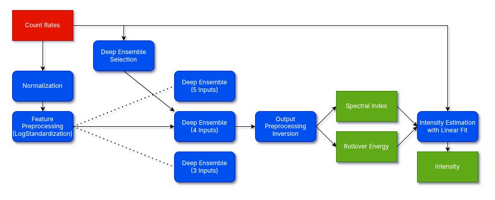

# Differential Flux Reconstruction with Deep Ensembles

This repository contains the code and data used for the paper "Flux reconstruction with Machine Learning techniques for the ESA JUICE mission radiation monitor, RADEM", yet to be peer-reviewed and published in the American Geophysical Union (AGU).

The machine learning model consists of three ensembles of 20 independently trained neural networks. Each ensemble has a different number of inputs. During inference, ensemble selection is done by comparing the input count rates to their background levels to reduce the effect of the background count rates on the model outputs (more details in the paper).

<picture>
 
</picture>

## Project Structure

* **Data/**
  * **FullData-RAW/**: RADEM measurements (21/10/2023 to 17/02/2025)
  * **NeuralNetworks/**: Trained ensemble neural network parameters, dataset scalers and simulated datasets *(Note: hyperparameter tuning experiments are excluded from Git due to file size)*
  * **Response Functions/**: RADEM detection bin response functions
  * **STEREO-A/**: STEREO-A radiation monitor differential flux measurements
* **Images/**: Plots from the scripts and Jupyter notebooks
* **JupyterNotebooks/**: Jupyter Notebooks that evaluate the performance of the machine learning model
* **Modules/**: Python modules used by this project
* **Scripts/**
  * **NeuralNetworkDevelopment/**: Executable scripts for dataset simulation, model training pipelines and hyperparameter tuning
  * **Tests/**: Executable scripts that test some of the Python modules

This project uses **Python 3.14**. All dependencies are listed in **requirements.txt**.

## How to Set Up the Virtual Environment

Create the virtual environment:
```bash
python -m venv DiffFluxReconstruction-venv
```

Activate the virtual environment:

 * Linux/macOS:
  
 ```bash
 source DiffFluxReconstruction-venv/bin/activate
 ```

* Windows (Command Prompt):
  
```cmd
DiffFluxReconstruction-venv\Scripts\activate.bat
```

Install the required libraries and the Python modules developed in this project:
```bash
pip install -r requirements.txt
```
