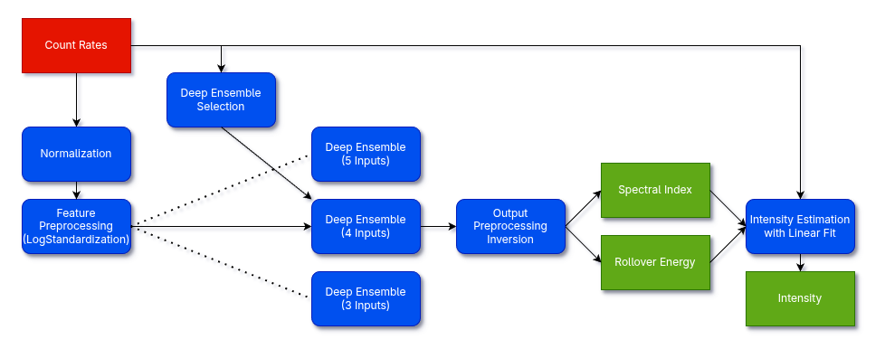

# Differential Flux Reconstruction with Deep Ensembles

This repository contains the code and data used for the paper:  
**"Flux reconstruction with Machine Learning techniques for the ESA JUICE mission radiation monitor, RADEM"**  
**Authors:** Rafael Antunes Parente, Marco Pinto, Inês Ochoa, António Pessanha Gomes, Patrícia Gonçalves  
**Preprint:** [https://doi.org/10.22541/essoar.15005326/v1](https://doi.org/10.22541/essoar.15005326/v1)  

In this project, a machine learning model was developed to reconstruct the differential proton flux spectrum from RADEM count rates by estimating the parameters of the rolling power law spectrum (also known as the Ellison-Ramaty form):
* **Flux Intensity**
* **Spectral Index**
* **Rollover Energy**

## Architecture & Methodology

* **Dynamic Ensemble Selection:** 
   The model comprises of three deep ensembles (20 independently trained DNNs each), varying by the number of inputs. Input count rates are dynamically evaluated against background levels to select the optimal ensemble, minimizing the impact of background count rates on the estimated parameters.

* **Parameter Sampling:** 
   The selected ensemble outputs 20 pairs of (Spectral Index, Rollover Energy) samples.

* **Flux Intensity Calculation:** 
   Linear regression is applied to the estimated parameter samples to calculate corresponding Flux Intensity samples.

* **Uncertainty Estimation:** 
   The final flux parameters are calculated as the mean across all ensemble samples, with their standard deviations representing the ensemble uncertainty.

*For a detailed breakdown of the model architecture and training process, please refer to the publication.*

<picture>
 
</picture>

## Project Structure

* **Data/**
  * **FullData-RAW/**: RADEM measurements (21/10/2023 to 17/02/2025)
  * **NeuralNetworks/**: Trained ensemble neural network parameters, dataset scalers and simulated datasets *(Note: hyperparameter tuning experiments are excluded from Git due to file size)*
  * **Response Functions/**: RADEM detection bin response functions
  * **STEREO-A/**: STEREO-A radiation monitor differential flux measurements
* **Images/**: Plots from the scripts and Jupyter notebooks
* **JupyterNotebooks/**: Jupyter Notebooks that apply the machine learning model to RADEM count rate data and evaluate the performance of the model.
* **Modules/**: Python modules used by this project
* **Scripts/**
  * **NeuralNetworkDevelopment/**: Executable scripts for dataset simulation, model training pipelines and hyperparameter tuning
  * **Tests/**: Executable scripts that test some of the Python modules

This project uses **Python 3.14**. All dependencies are listed in **setup.py**.

## How to Set Up the Virtual Environment

Create the virtual environment:
```bash
python -m venv DiffFluxReconstruction-venv
```

Activate the virtual environment:

 * Linux/macOS:
  
 ```bash
 source DiffFluxReconstruction-venv/bin/activate
 ```

* Windows (Command Prompt):
  
```cmd
DiffFluxReconstruction-venv\Scripts\activate.bat
```

Install the required libraries and the Python modules developed in this project:
```bash
pip install -r requirements.txt
```
